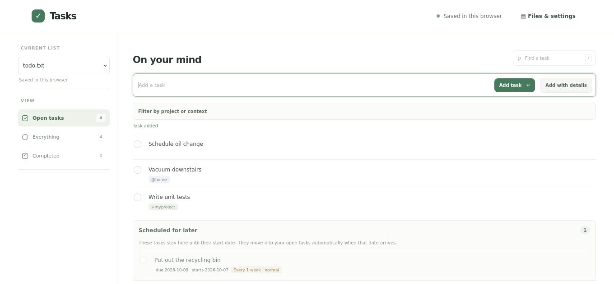

# todo.txt Web

A simple, local-first task manager with projects, contexts, priorities, due
dates, start dates, and recurring tasks. Use it with browser storage alone, or
optionally connect it to
[Plain File Server](https://github.com/dthigpen/plain-file-server) to open your
task lists from a server. Lists stay portable as plain-text todo files.



## Get started

Requires Node.js 20.19 or newer.

```sh
npm install
npm run dev
```

The app starts in local mode and saves changes in your browser. Use **Files**
to switch between documents, import a todo.txt file, or export the current
file. Create additional lists there, or rename, delete, and export saved lists.
Switch lists from **Current list** beside the task filters. The default
document is `todo.txt`; the app remembers the last list you used. Install it
from a supported browser to launch it like an app. Its static app shell is
cached for offline startup, while your lists and edits are stored locally in
the browser.

## Optional Plain File Server

Open **Files & settings**, enter the server API URL (for example,
`http://127.0.0.1:3000/api`), and sign in. Choose an existing accessible path
or enter another path, such as `household/todo.txt`, if your account has access.
The server enforces path permissions. Use the checkboxes in settings to choose
which readable server files are task lists; other server files stay out of the
main list picker.

The app caches the current document locally and writes remote changes with
`If-Match` using its latest ETag. While signed in, it checks cached server lists
when opened, on reconnect or return to the tab, and periodically in the
background using conditional ETag requests. Lists with no unsynced edits
update in place when the server has newer content; overlapping changes keep
both copies and appear in the existing conflict review. If you go offline,
edits stay saved in this browser and sync automatically when the server is
reachable again. Previously
selected server lists remain in the list switcher and can be viewed and edited
from their saved device copies when offline or signed out. Those edits wait
until you sign in and reconnect. A sync indicator shows which lists are
waiting. Completing/reopening a task or saving it in the task editor offers a
brief Undo action; it is cleared if that list changes again. If another client changes a file
first, or a save response is lost during a connection drop, the app preserves
your local copy and flags the conflict rather than silently overwriting the
server version. **Review & resolve** loads the latest server copy and lets you
use the server version, use your device's version, or select individual tasks
from both into a merge. Unchanged tasks are included automatically and hidden
until expanded. Added and removed lines are identified against the last shared
version; checking a removed task restores it. Task edits appear as a removal
and an addition because todo.txt lines have no unique IDs. **Keep all tasks
from either copy** is available, with a warning that it may restore intentional
deletions. The resolved version syncs using the server's latest ETag. Use
HTTPS or a trusted private network for remote access. The login token is stored
in this browser's localStorage; log out on shared devices.
The server file browser has search and collapsible folders; only selected task
lists appear in the main list switcher. Login errors caused by mixed content,
untrusted HTTPS certificates, or CORS include troubleshooting hints. CORS must
allow the deployed app's exact GitHub Pages origin and the `If-None-Match`
request header used for conditional refresh.

## Scripts

```sh
npm run dev          # local development
npm test             # parser and task behavior tests
npm run lint         # ESLint
npm run format       # apply Prettier
npm run format:check # verify formatting
npm run build        # static production build
npm run preview      # preview the production build
```

The Vite build uses relative paths and is ready to publish as a static GitHub
Pages site. The repository workflow builds and deploys on pushes to `main`
after GitHub Pages is configured to use **GitHub Actions** as its source
(Repository **Settings → Pages → Build and deployment → Source → GitHub Actions**).
Do not select **Deploy from a branch**: that serves the unbuilt repository
files, including `src/main.jsx`, and results in a blank page. The workflow
checks that `dist/` contains bundled JavaScript and CSS before it uploads the
Pages artifact.

See [DESIGN.md](DESIGN.md) for the product behavior, file format rules, and
implementation scope.
